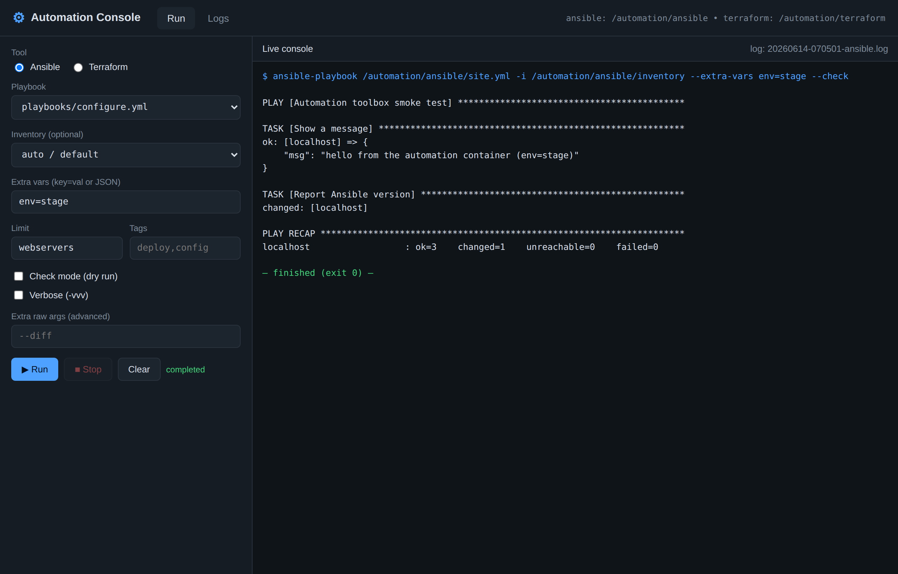
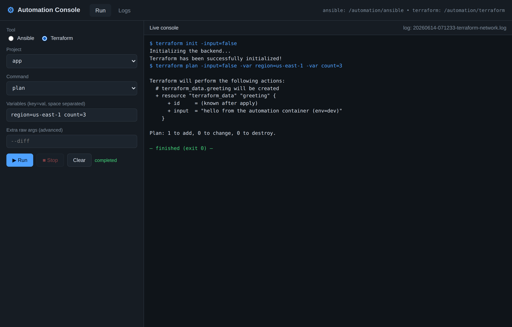
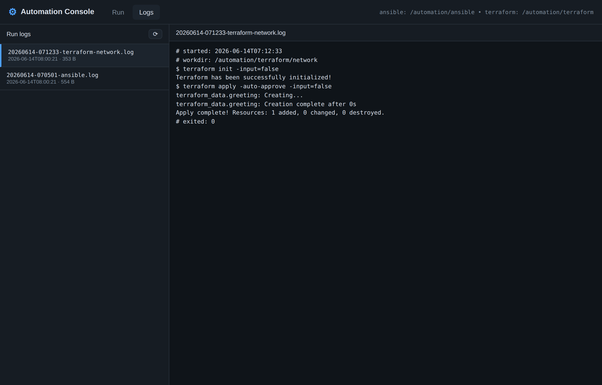

# docker-automation

A single container image that bundles **Ansible** and **Terraform** as a
console-first automation toolbox, with an **optional** web interface for
running them with live console output and a log viewer.

- 🧰 **Ansible + Terraform preinstalled** in one image
- 📦 **Declarative requirements** — add Galaxy collections/roles and Python
  packages via placeholder files; they are baked in at build time and can be
  (re)installed at runtime
- 📁 **Mount points** for your own playbooks/inventory and Terraform projects
- 🖥️ **Optional web UI** with a live streaming console and log viewer —
  **no hard dependency**; everything works from the console
- 🚀 **End-to-end CI/CD** that builds, smoke-tests, and publishes a multi-arch
  image to the GitHub Container Registry (GHCR)

---

## Quick start

### Pull the published image

```bash
docker pull ghcr.io/zollo/docker-automation:latest
```

### Run something from the console

```bash
# Ansible (auto-discovers playbooks in /automation/ansible, logs the run)
docker run --rm -v "$PWD/automation/ansible:/automation/ansible" \
  ghcr.io/zollo/docker-automation:latest automation ansible site.yml

# Terraform (each subdir with *.tf is a project)
docker run --rm -v "$PWD/automation/terraform:/automation/terraform" \
  ghcr.io/zollo/docker-automation:latest \
  /bin/bash -lc "automation terraform example init && automation terraform example plan"

# Raw tools are also available directly
docker run --rm ghcr.io/zollo/docker-automation:latest ansible --version
docker run --rm ghcr.io/zollo/docker-automation:latest terraform version
```

### Start the optional web interface

```bash
docker run --rm -p 8080:8080 \
  -v "$PWD/automation:/automation" \
  ghcr.io/zollo/docker-automation:latest web
# open http://localhost:8080
```

### Or use docker compose

```bash
docker compose run --rm automation ansible site.yml   # console
docker compose up web                                 # web UI on :8080
```

---

## How it works

### Entrypoint / commands

The container's entrypoint dispatches the first argument:

| Command                                       | Effect                                                |
| --------------------------------------------- | ----------------------------------------------------- |
| `help` *(default)*                            | Show CLI help                                         |
| `automation ansible <playbook> [args]`        | Run a playbook (logged, auto-inventory)               |
| `automation terraform <project> <cmd> [args]` | Run Terraform in a project dir (logged)               |
| `automation <subcommand> …`                   | The full CLI (see `automation help`)                  |
| `ansible …` / `terraform …`                   | Run the raw tool directly (e.g. `ansible --version`)  |
| `install`                                     | Install requirements (collections/roles/pip)          |
| `web`                                         | Start the optional web interface                      |
| `shell` / `bash`                              | Interactive shell                                     |
| *anything else*                               | Run verbatim                                          |

The `automation` CLI is on `PATH`, so inside a shell you can run
`automation ansible site.yml`, `automation terraform example plan`,
`automation logs`, etc. The bare `ansible` / `terraform` commands are the raw
tools, so use the `automation` wrappers when you want logging and the mount
directories resolved for you.

### Mount points

| Path                     | Purpose                                    |
| ------------------------ | ------------------------------------------ |
| `/automation/ansible`    | Playbooks, inventory, roles, vars          |
| `/automation/terraform`  | Terraform projects (one per subdirectory)  |
| `/automation/logs`       | Run logs (written by CLI **and** web UI)   |

See [`automation/ansible/README.md`](automation/ansible/README.md) and
[`automation/terraform/README.md`](automation/terraform/README.md) for the
expected layouts. The repo ships small no-op samples so the image works as an
immediate smoke test.

### Requirements files

Declare dependencies without touching the Dockerfile — see
[`requirements/README.md`](requirements/README.md):

| File                                   | Installs                              |
| -------------------------------------- | ------------------------------------- |
| `requirements/ansible-requirements.yml`| Galaxy **collections** and **roles**  |
| `requirements/python-requirements.txt` | Python packages / SDKs / plugin deps  |

They are installed at **build time** and can be reinstalled at **runtime**:

```bash
# Reinstall mounted requirements into a running/ephemeral container
docker run --rm -v "$PWD/requirements:/opt/automation/requirements" \
  ghcr.io/zollo/docker-automation:latest install

# …or automatically on container start
docker run --rm -e INSTALL_REQUIREMENTS_ON_START=true \
  -v "$PWD/requirements:/opt/automation/requirements" \
  ghcr.io/zollo/docker-automation:latest web
```

> Terraform providers are **not** listed here — they are declared per project
> and fetched by `terraform init`.

---

## Web interface

The web UI ([`web/`](web/)) is a small FastAPI + Uvicorn app. It:

- discovers mounted playbooks, inventories, and Terraform projects
- runs the selected tool with custom params/overrides (extra vars, limit, tags,
  check mode, Terraform action, `-var`s, raw args)
- **streams output live** over a WebSocket into an in-browser console
- writes every run to `/automation/logs` and provides a **log viewer**
- lets you **stop** a running job

It is strictly optional: the rest of the container never imports it, so the
toolbox is fully usable without ever starting the web server. Configure it with:

| Env var   | Default   | Meaning            |
| --------- | --------- | ------------------ |
| `WEB_HOST`| `0.0.0.0` | Bind address       |
| `WEB_PORT`| `8080`    | Port               |

### Screenshots

Running an Ansible playbook with custom params and a live console:



Running Terraform (auto-`init` + `plan`/`apply`) with variable overrides:



Browsing previous run logs:




> **Security:** the web UI runs automation tools and only restricts paths to
> the mounted directories. Treat it as a privileged control plane — keep it on
> a trusted network or behind an authenticating reverse proxy. Do not expose it
> directly to the public internet.

---

## CI/CD

[`.github/workflows/ci.yml`](.github/workflows/ci.yml) runs on every push, tag,
and PR:

1. **lint** — `hadolint` (Dockerfile) and `shellcheck` (shell scripts)
2. **build** — build a local image and **smoke test** it
   (`ansible --version`, `terraform version`, run the bundled samples, verify
   the web stack imports)
3. **publish** — on non-PR events, build a **multi-arch** (`amd64` + `arm64`)
   image and push to `ghcr.io/<owner>/<repo>` using the built-in `GITHUB_TOKEN`

Image tags follow the branch/tag/sha, plus `latest` on the default branch and
semver tags for `v*` releases.

### Configuration knobs

| Build arg / env       | Default  | Purpose                          |
| --------------------- | -------- | -------------------------------- |
| `TERRAFORM_VERSION`   | `1.10.5` | Terraform version baked in       |
| `TARGETARCH`          | (auto)   | Set by BuildKit for multi-arch   |

```bash
docker build --build-arg TERRAFORM_VERSION=1.10.5 -t automation:dev .
```

---

## Repository layout

```
.
├── Dockerfile                 # Ansible + Terraform + optional web stack
├── docker-compose.yml         # console + web services
├── entrypoint.sh              # command dispatcher
├── bin/automation             # console-first CLI (logs every run)
├── scripts/                   # install-requirements.sh, run-web.sh
├── requirements/              # placeholder requirements (collections/roles/pip)
├── automation/
│   ├── ansible/               # mount point + sample playbook & inventory
│   ├── terraform/             # mount point + sample project
│   └── logs/                  # run logs (CLI + web)
├── web/                       # optional FastAPI web interface
└── .github/workflows/ci.yml   # build → test → publish to GHCR
```
